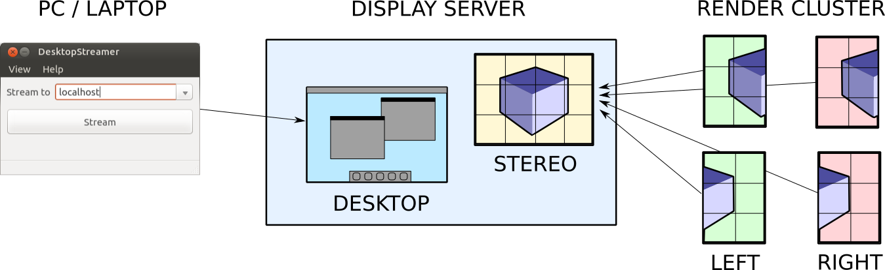

# Deflect

Welcome to Deflect, a C++ library for streaming pixels to other Deflect-based
applications, for example [Tide](https://github.com/BlueBrain/Tide).
Deflect offers a stable API marked with version 1.0 (for the client part).

## Overview

## Features

Deflect provides the following functionality:

* Stream pixels to a remote Server from one or multiple sources
* Stream stereo images from a distributed 3D application
* Receive input events from the Server and send data to it
* Transmitted events include keyboard, mouse and multi-point touch gestures
* Compressed or uncompressed streaming
* Fast multi-threaded JPEG (de)compression using libjpeg-turbo

DeflectQt (optional) provides the following additional functionality:

* Create QML applications which render offscreen and stream and receive events
  via Deflect

The following applications are provided which make use of the streaming API:

* DesktopStreamer: A small utility that lets you stream your desktop.
* SimpleStreamer: A simple example to demonstrate streaming of an OpenGL
  application.
* QmlStreamer (optional): An offscreen application to stream any given qml file.

## Building from source

~~~
  git clone --recursive https://github.com/BlueBrain/Deflect.git
  mkdir Deflect/build
  cd Deflect/build
  cmake -GNinja ..
  ninja
~~~

## ChangeLog

To keep track of the changes between releases check the @ref Changelog.

## About

Deflect is a cross-platform library, designed to run on any modern operating
system, including all Unix variants. Deflect uses CMake to create a
platform-specific build environment. The following platforms and build
environments are tested:

* Linux: Ubuntu 16.04 and RHEL 6 (Makefile, Ninja; x64)
* Mac OS X: 10.7 - 10.10 (Makefile, Ninja; x86_64)

The [latest API documentation](http://bluebrain.github.io/Deflect-1.0/index.html)
can be found on [bluebrain.github.io](http://bluebrain.github.io).

## Funding & Acknowledgment
 
The development of this software was supported by funding to the Blue Brain Project,
a research center of the École polytechnique fédérale de Lausanne (EPFL), from the 
Swiss government’s ETH Board of the Swiss Federal Institutes of Technology.

This project has received funding from the European Union’s FP7-ICT programme
under Grant Agreement No. 604102 (Human Brain Project RUP).

This project has received funding from the European Union's Horizon 2020 Framework
Programme for Research and Innovation under the Specific Grant Agreement No. 720270
(Human Brain Project SGA1).

This project is based upon work supported by the King Abdullah University of Science
and Technology (KAUST) Office of Sponsored Research (OSR) under Award No. OSR-2017-CRG6-3438.

## License

Deflect is licensed under the LGPL, unless noted otherwise, e.g., for external dependencies.
See file LICENSE.txt for the full license. External dependencies are either LGPL or BSD-licensed.
See file ACKNOWLEDGEMENTS.txt and AUTHORS.txt for further details.

Copyright (C) 2013-2022 Blue Brain Project/EPFL, King Abdullah University of Science and
Technology and AUTHORS.txt.

This library is free software; you can redistribute it and/or modify it under the terms of the
GNU Lesser General Public License version 2.1 as published by the Free Software Foundation.

This library is distributed in the hope that it will be useful, but WITHOUT ANY WARRANTY; without
even the implied warranty of MERCHANTABILITY or FITNESS FOR A PARTICULAR PURPOSE. See the GNU
Lesser General Public License for more details.

You should have received a copy of the GNU Lesser General Public License along with this library;
if not, write to the Free Software Foundation, Inc., 51 Franklin Street, Fifth Floor, Boston,
MA 02110-1301 USA

