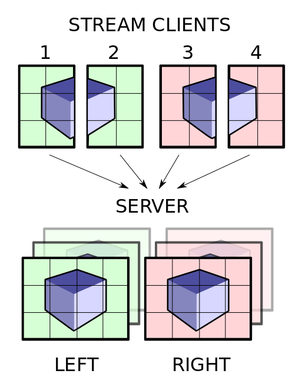

Stereo Streaming
============

This document describes the stereo streaming support introduced in Deflect 0.13.

## Requirements

* Simple extension of the monoscopic Stream API
* No network protocol changes that break current Deflect clients or servers
* Support both screen space decompostion (sort-first) and left-right stereo
  decomposition modes for distributed rendering.

## API

New view enum in deflect/types.h:

    enum class View : std::int8_t { mono, left_eye, right_eye };

The ImageWrapper takes an additional View parameter.

API changes to the Stream class:
* asyncSend is renamed to sendAndFinish, asyncSend forwards and is deprecated
* send and finish are now asynchronous and return a future instead of bool

The send operation sends one tile of one eye pass to the server. The finishFrame
operation completes the whole frame for all eye passes, that is, send is
analogous to an OpenGL draw pass (GL_BACK, GL_BACK_LEFT, GL_BACK_RIGHT), and
finishFrame is analogous to a swap buffer call, with the extension that all
client's finish is synchronized by the server.

On the server side, no changes to the Server API (except some cleanups). Each
Segment dispatched now with a Frame contains the View information. A frame is
considered complete when all connected clients have send a finish.

## Protocol

The Stream send an additional View information message before each image
payload. This message is silently ignored by older Servers.

## Examples

Example of a stereo 3D client application using synchronous operations:

    deflect::Stream stream( ... );

    /** ...synchronize start with other render clients (network barrier)... */

    renderLoop()
    {
    /** ...render left image... */

    deflect::ImageWrapper leftImage( data, width, height, deflect::RGBA );
    leftImage.view = deflect::View::left_eye;
    deflectStream->send( leftImage ).wait();

    /** ...render right image... */

    deflect::ImageWrapper rightImage( data, width, height, deflect::RGBA );
    rightImage.view = deflect::View::right_eye;
    deflectStream->send( rightImage ).wait();

    deflectStream->finishFrame().wait();

    /** ...synchronize with other render clients (network barrier)... */
    }

Example of a stereo 3D client application using the asynchronous operations:

    deflect::Stream stream( ... );

    /** ...synchronize start with other render clients (network barrier)... */
    std::vector< std::future< bool >> futures;
    renderLoop()
    {
    for( auto& future : futures )
        if( !future.get( ))
            return;
    futures.clear();

    /** ...render left image... */

    deflect::ImageWrapper leftImage( leftData, width, height, deflect::RGBA );
    leftImage.view = deflect::View::left_eye;
    futures.emplace_back( deflectStream->send( leftImage ));

    /** ...render right image... */

    deflect::ImageWrapper rightImage( rightData, width, height, deflect::RGBA );
    rightImage.view = deflect::View::right_eye;
    futures.emplace_back( deflectStream->send( rightImage ));

    futures.emplace_back( deflectStream->finishFrame( ));

    /** ...synchronize with other render clients (network barrier)... */
    }

For a complete code example, please refer to the SimpleStreamer application.

## Issues

### 1: Should clients be notified if they attempt to stream stereo content to a server which can only handle monoscopic content?

_Resolution: Not yet:_
For legacy implementation reasons, it is not possible to
send information from the Server to the Stream about the capabilities of the
server (such as stereo support) without rejecting all clients based on Deflect
< 0.12.1. A transition period is required before implementing this feature.
